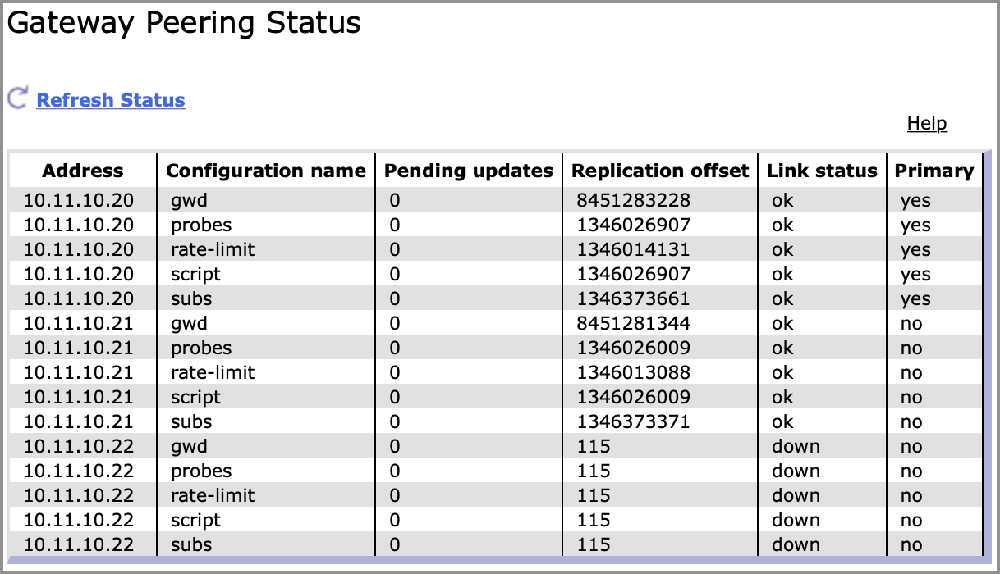
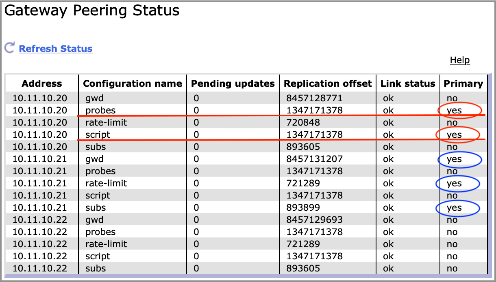
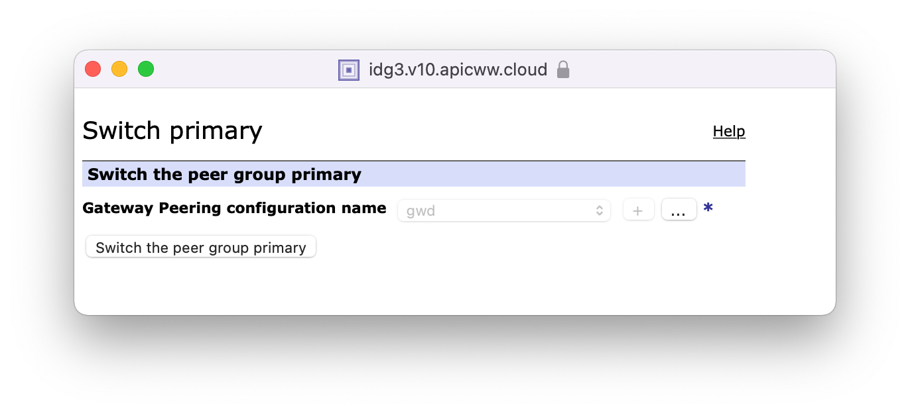
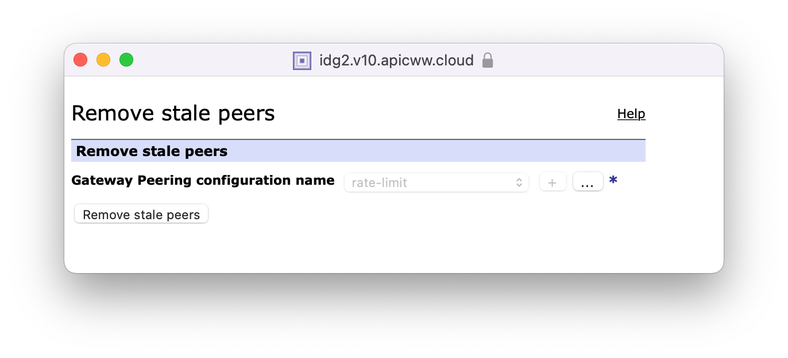
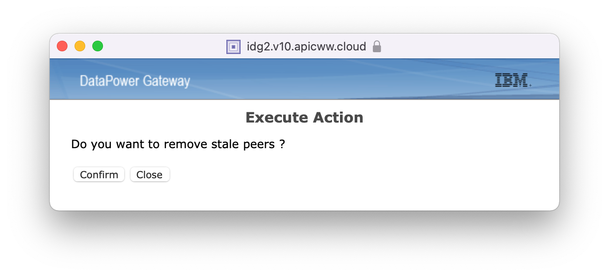
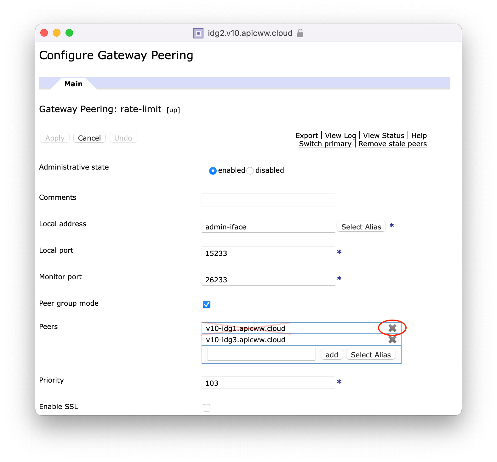

# Removing a gateway peer from a peer group

This document covers the Gateway Peering feature in the IBM DataPower Gateway. When decommissioning and permanently removing a gateway from a peer group, it's a good idea to ensure the peer group knows it's gone. Otherwise, it may assume it's a regular outage and count the decommissioned gateway against quorum.

When a gateway goes out of service for any reason, the peer group will sense that it's down. In response, the group will usually set its *Link Status* to "down", but occasionally it'll just remove the peer from the group automatically. This guide is really about how to _ensure_ the peer group has removed the peer. 

## When to remove a peer

Usually, this is only necessary when permanently removing a gateway node from the peer group. This section shows a few scenarios and the implications of removing the peer in these scenarios.

### Short-term outage of individual nodes

In this case, it is safe but unnecessary to remove peers from the peer group. Once a peer becomes available again, it'll automatically add itself back into the group. If more than half the gateway peers remain in service, the peer group remains in quorum and it will reassign the primary node to one of the remaining gateways.

If fewer than half the peers in the group remain in service, ensure that one of the remaining nodes is the primary node. If necessary, [reassign the primary node](#reassigning-the-primary-node).

### Long term outage

Long-term outages are best treated the same way as permanent outages.

### Permanent outage

In a permanent outage, it is when it's best to remove the node entirely from a peer group.

### Loss of communication between nodes

Many companies will split their gateway peer group among multiple data centers in case there's a problem with one. In my example, I will use a hypothetical data center in Edmonton with three nodes, `idg1`, `idg2` and `idg3` and another in Leduc with two nodes, `idg4`, and `idg5`.

If there were a communication loss between Edmonton and Leduc, but all gateways remain in operation, the peer group will assign one of the gateways in Edmonton as the primary node and the gateways in Leduc will not receive updates until connectivity is restored. In this case, it's also a good idea to update the load balancers to ensure that the gateways in Leduc also do not serve API traffic. Once connectivity is restored, the nodes in Edmonton will automatically update the nodes in Leduc.

If there were a total connectivity loss with Edmonton and only Leduc could serve API traffic, manually [reassign the primary node](#reassigning-the-primary-node) to `idg4` or `idg5`. Once connectivity is restored, Leduc will automatically update Edmonton's nodes.

## Before taking a node out of service

Before taking a node out of service, check if it's the primary node. While the peer group will reassign the primary nodes automatically, it's better to proactively reassign the primary than to wait for the gateway to detect an outage and react to it.

In this case, if we wanted to take `10.11.10.20` out of service, we should reassign the primary node of the `probes` and `script` peer groups first.

### Reassigning the primary node

Choose one host to be your new primary node. Log into this machine to assign it to be the primary.

For each peer group:
1. Select the peer group name. 
1. Click "Switch Primary". 
1. In the dialogue that comes up, click "Switch the peer group primary". 
1. Confirm. 
1. Close. If this peer is already the primary, this dialogue will show an error. This is ok. 

## Taking a node out of service

Disable the node by either shutting it down or disabling the application domain. 

It may take a few minutes before the *Gateway Peering Status* on all the peer groups show a *Link status* of "down", and some nodes will completely disappear from the status screen. Log into another node in the peer group to view this status. As you can see in this screenshot, all the peers on `10.11.10.20` are down and the `gwd` peer is completely missing. 

### Removing the nodes from the peer group

This process is very similar to that of reassigning a primary node, except that instead, we're clicking "Remove stale peers"

Choose one host to be your new primary node. Log into this machine to assign it to be the primary.

For each peer group:
1. Select the peer group name. In this case, I skipped `gwd` because it already removed itself. Performing these steps on `gwd` is harmless but unnecessary. 
1. Click "Remove stale peers". 
1. In the dialogue that comes up, click "Remove stale peers". 
1. Confirm. 
1. Close. 

### Clean up the peer groups

In the previous step, we has removed the dead gateway from all teh peer groups, but as soon as that gateway is revived, it'll automatically return to all the peer groups.

If you do not intend to replace or revive the gateway you just removed, it's a good idea to go through the peer group configurations and remove the dead gateway from the Peers list.

## Summary

In this document we covered:
* When to remove peers from peer groups
* How to change the primary node in a peer group
* How to remove the peer from the peer group
